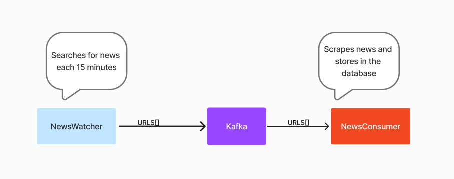
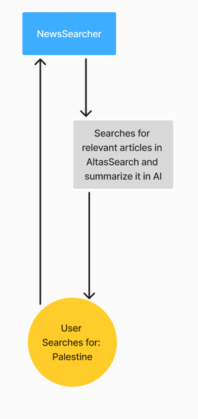

# News Article Agent

## Overview

News Article Agent is a full-stack JavaScript application designed for real-time news retrieval, processing, and querying using a Retrieval-Augmented Generation (RAG) system. The application ingests news articles, extracts content, and allows users to search and summarize articles using an AI-powered search engine.

## Features

- **Automated News Ingestion:** Collects news articles every 15 minutes using Kafka.
- **News Processing and Storage:** Extracts, cleans, and stores articles in a MongoDB database.
- **AI-Powered Query System:** Uses Langchain and Google Gemini API to summarize and respond to user queries.
- **GraphQL API:** Exposes endpoints for retrieving processed articles and querying with natural language.
- **Response Streaming:** Utilizes GraphQL subscriptions to enable real-time responses.
- **Microservices Architecture:** Divides responsibilities across dedicated services.

## Technology Stack

- **Backend:** Node.js with TypeScript
- **API:** GraphQL with GraphQL Yoga
- **Web Scraping:** Playwright
- **Database:** MongoDB, Atlas Vector Search
- **LLM Integration:** Langchain with Gemini API
- **Message Queue:** Kafka

## Architecture

### Services Design

- **NewsWatcher:** Periodically searches for news articles and sends URLs to Kafka.
- **NewsConsumer:** Scrapes news content and stores it in MongoDB.
- **NewsSearcher:** Retrieves relevant articles based on user queries and summarizes them using AI.
- **LLM Hub:** A centralized service to integrate various LLM models, simplifying their use within the application.




## Optimizations

### Implemented

- **Caching in LLM Queries:**

  ```javascript
  this.chatModel = new ChatGoogleGenerativeAI({
    apiKey: process.env.GEMINI_API_KEY,
    model: LLM_CONFIG.chatModel,
    cache: true,
  });
  ```

- GraphQL Subscriptions for response streaming.
- Microservices Architecture for scalability.
- LLM Hub to allow easy switching between different models.

### Possible Future Optimizations

- Implement Redis caching for faster responses.
- Perform vector searches on each request for more accurate results.

## Running the Application

To start the application, navigate to the project root and run:

```bash
docker compose up
```

This will set up all necessary services, including the database, Kafka, and the API server.

## Thanks for the opportunity

I appreciate the chance to share my experience and learn more about your team. I'm excited about the possibility of contributing and look forward to what’s ahead!
